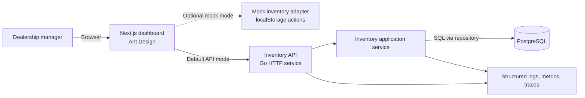
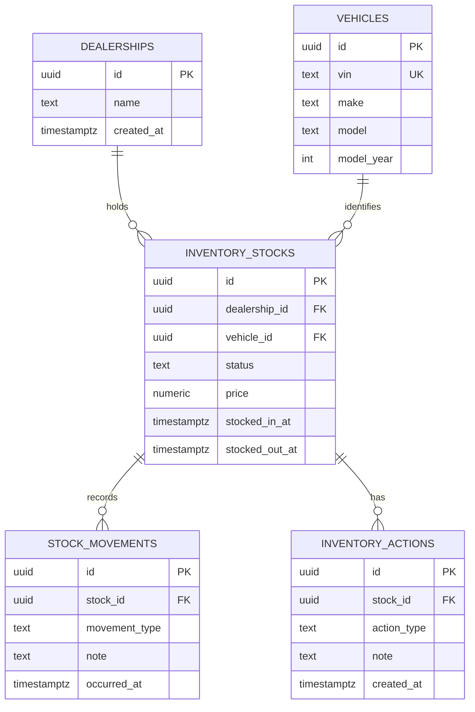

# Scenario B - Intelligent Inventory Dashboard

## 1. Purpose and scope

The system gives a dealership manager a current, filterable view of vehicle
inventory, calls out vehicles held for more than 90 days, and records proposed
actions for those aging vehicles.

The repository contains both a Go backend scaffold and a working Next.js
dashboard. The frontend uses the REST API by default and retains a mock
data-source adapter for isolated UI development. The source can be switched
through an environment variable without changing dashboard components.

## 2. Assumptions

- Authentication is outside the challenge scope. Dealerships are explicit API
  resources, and inventory routes include `dealershipID` in the URL so the
  frontend can list and switch between seeded dealerships.
- A vehicle is in stock while `sold_at` is `NULL`. Inventory age is the count of
  calendar days between `stocked_at` and the API's current UTC date.
- A vehicle becomes aging stock at **91 days or more** (strictly more than 90
  days), including when it crosses the threshold without any data change.
- An aging vehicle may have multiple action-history entries. The latest entry
  is its current displayed status; history is retained for auditability.
- Vehicle make and model matching is case-insensitive partial matching. Age
  filters are expressed as minimum and/or maximum inventory days.

## 3. Architecture

The challenge deployment is a deliberately small modular monolith. It has
clear seams for eventual extraction, but avoids distributed-system complexity
where a single dealership inventory service and one relational database are
enough.

## 4. Component responsibilities

| Component | Responsibility |
| --- | --- |
| Next.js dashboard | Display inventory summaries, dealership selection, filters, aging indicators, and the action form using Ant Design. |
| Frontend data-source adapter | Call the dealership-scoped REST API by default, or provide mock data and local persistence for isolated UI work. |
| REST handlers | Validate HTTP requests and dealership identifiers, map errors to stable API responses, and serialize JSON. |
| Inventory application service | Own list/filter behavior, aging-stock calculation, and the rule that actions can only be recorded for aging vehicles. |
| Model-specific repositories | Separate dealership, vehicle, stock, action, and movement persistence contracts. The stock repository owns the atomic status transition and movement insert. |
| PostgreSQL | Persist vehicle identity, dealership stock state, and immutable movement/action history; provide indexed filtering and consistent writes. |
| Atlas migration service | Generate schema migrations from separated GORM models, verify `atlas.sum`, apply migrations before backend startup, and load deterministic seed data from a separate migration. |
| Observability adapter | Emit request-correlated logs, metrics, and tracing spans without coupling domain logic to a vendor. |

## 5. Data model

Key constraints and indexes:

- `vehicles(vin)` is globally unique vehicle identity; stock is unique by
  `(dealership_id, vehicle_id)`.
- Stock status, movement type, and action type are protected by check
  constraints matching backend enums.
- `(dealership_id, status)` and `stocked_in_at` support scoped status/age
  filtering; make and model indexes support search and dynamic allowlisted sort.
- Movement and action indexes order each stock's append-only history newest first.

## 6. API surface

| Method and path | Behavior |
| --- | --- |
| `GET /api/v1/dealerships` | List seeded dealerships for the frontend dealership selector. |
| `GET /api/v1/dealerships/{dealershipID}/stocks` | Paginated stock list with search, make/model/status/age filters, and enum-constrained dynamic sorting. |
| `GET /api/v1/dealerships/{dealershipID}/stocks/aging` | Return only in-stock inventory older than 90 calendar days. |
| `POST /api/v1/dealerships/{dealershipID}/stocks/{stockID}/actions` | Append an enum-coded action and note for aging, in-stock inventory. |
| `POST /api/v1/dealerships/{dealershipID}/stocks/{stockID}/movements` | Atomically append `STOCK_IN`/`STOCK_OUT` and transition current stock state. |
| `GET /api/v1/dealerships/{dealershipID}/stocks/{stockID}/history` | Merge movement and action history newest first. |
| `GET /healthz` and `GET /readyz` | Liveness and database-readiness endpoints for local and production deployment. |

List responses include pagination metadata (`page`, `pageSize`, `total`). Page
size is capped at 100, and `minAgeDays <= maxAgeDays` when both are supplied.

## 7. Primary data flows

### Inventory dashboard load

1. The client calls `GET /api/v1/dealerships/{dealershipID}/stocks` with
   optional filters.
2. The handler validates query parameters and passes the route dealership ID
   to the application service.
3. The service computes age relative to the injected UTC clock and asks the
   stock repository for matching inventory and the action repository for the latest action per stock.
4. PostgreSQL filters by dealership and returns a single paginated result set.
5. The API calculates/returns aging flags, emits telemetry, and responds with
   JSON. A frontend can render the `is_aging` flag as a prominent badge or
   aging-stock panel.

### Record an aging-stock action

1. The manager submits an action enum and note to
   `POST /api/v1/dealerships/{dealershipID}/stocks/{stockID}/actions`.
2. The service loads the vehicle under the same dealership scope and calculates
   its current age using the shared clock.
3. If the vehicle is not in stock or is 90 days old or younger, the request is
   rejected without a write.
4. Otherwise, a transaction inserts the action history record and returns the
   newly created action. The next list request reflects it as the current action.

## 8. Technology choices

| Technology | Why |
| --- | --- |
| Go with Echo and Uber Fx | Fast startup, clear HTTP routing, explicit lifecycle management, and straightforward unit/integration testing. |
| PostgreSQL | Durable relational storage, transactions, constraints, and excellent query/index support for dealership-scoped inventory. |
| GORM with the PostgreSQL driver | Matches the proven local Dreon boilerplate for query composition and connection pooling; its models are the desired schema consumed by Atlas, while `AutoMigrate` remains disabled. |
| Atlas with the GORM provider | Generates reviewed, versioned SQL from models, protects schema and seed migrations with `atlas.sum`, and applies them in a dedicated container. |
| Dreon SDK | Reuses structured logging and shared application-error behavior from the existing backend conventions. |
| OpenAPI 3.1 | A precise contract for the mocked frontend/API harness and a natural future client-generation point. |
| Docker Compose | One-command local PostgreSQL dependency while retaining the option to run the API natively. |
| OpenTelemetry API with Prometheus metrics | Vendor-neutral tracing and measurable service behavior. |

## 9. Reliability, performance, and security

- Queries are always dealership-scoped and parameterized; no raw user input is
  interpolated into SQL.
- The server applies request timeouts, graceful shutdown, bounded database pool
  settings, and a short database query timeout.
- The list endpoint uses pagination, bounded inputs, and indexes rather than
  loading all dealer inventory into memory.
- A single SQL query retrieves each vehicle's latest action rather than creating
  an N+1 query pattern.
- Database constraints protect invariants even if another client bypasses the
  API. The action insertion occurs transactionally.
- Authentication is deliberately omitted. TLS termination, secrets injection,
  and rate limiting remain deployment concerns outside the challenge runtime.

## 10. Observability strategy

- **Logs:** structured JSON logs containing request ID, route, status, latency,
  dealership ID (non-sensitive), vehicle ID where applicable, and error class.
  VINs and free-text notes are not logged by default.
- **Metrics:** request count/duration/error rate by route, database query
  duration/errors, active connections, and domain counters for aging vehicles
  returned and actions created/rejected.
- **Traces:** an inbound HTTP span with child spans for application work and
  repository calls; request IDs are propagated to logs.
- **Health:** liveness checks process health; readiness confirms database
  connectivity. Alerts would cover sustained 5xx rate, latency, database
  failures, and readiness failures.

## 11. Test strategy

- Unit tests for aging-boundary behavior (90 vs. 91 days), filter validation,
  and the non-aging action rejection rule, using an injected fixed clock.
- Handler tests for HTTP validation, response schema, tenancy isolation, and
  error mappings.
- PostgreSQL integration tests for migrations, constraints, indexed query
  behavior, pagination, and transactional action persistence.
- A small end-to-end API harness uses seeded data to demonstrate filtering,
  aging-stock retrieval, action creation, and its subsequent visibility.

## 12. Delivery sequence

1. Scaffold the Go module, Compose environment, migrations, and seed data.
2. Implement the vehicle and action repositories with integration tests.
3. Implement application rules and deterministic unit tests.
4. Add REST handlers, OpenAPI contract, API examples, and end-to-end tests.
5. Add telemetry, health endpoints, README runbook, AI collaboration narrative,
   and final verification.

## 13. GenAI-assisted design narrative

GenAI was used as a collaborative design reviewer: it helped turn the brief
into explicit acceptance criteria, surfaced ambiguity around the 90-day
boundary and action-history semantics, and proposed alternative API/data-model
shapes. The final decisions remain deliberate human choices: a backend-only
scope, PostgreSQL persistence, a modular monolith, strict dealership scoping,
and an immutable action history.

Before implementation, every AI suggestion will be checked against the
requirements in `KeyloopCodingChallange.pdf`, API and database invariants, and
automated tests. Generated code will be reviewed for tenancy leaks, SQL safety,
error behavior, and observability before it is accepted.
