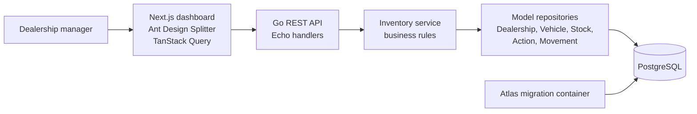
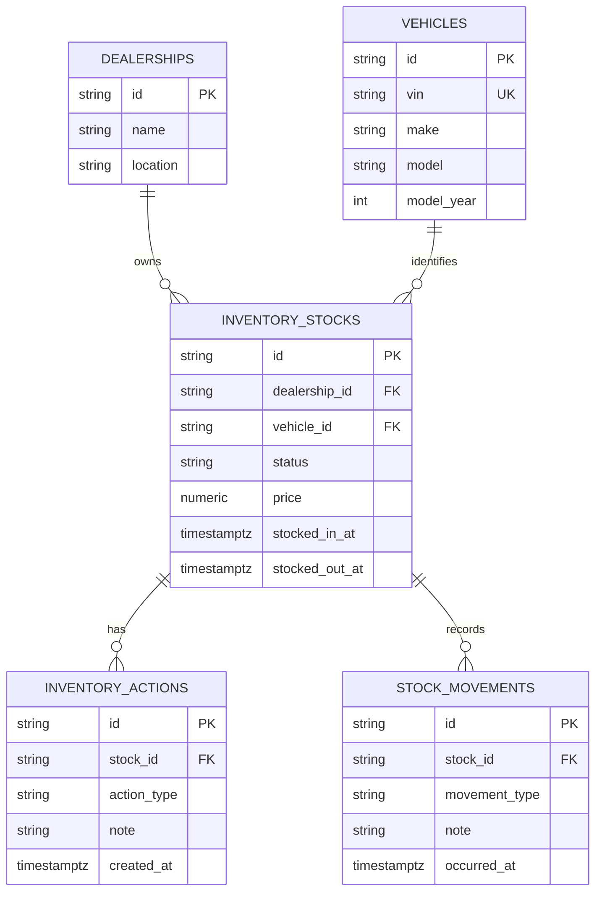

# Scenario B - Intelligent Inventory Dashboard

## Purpose

This project implements Scenario B for the Keyloop challenge: a dealership
manager can view current stock, find inventory older than 90 days, and record
follow-up actions for aging vehicles.

The final submission is a small full-stack system:

- `frontend/`: Next.js, Ant Design, and TanStack Query dashboard.
- `backend/`: Go REST API with Echo, GORM repositories, PostgreSQL, and Atlas
  migrations.
- `docker-compose.yml`: local PostgreSQL, migration, backend, and frontend
  runtime.

Authentication is intentionally omitted. Dealership context is explicit through
the API route and the dealership selector.

## Architecture Overview



The system is a modular monolith. That keeps the challenge easy to run and
review, while still separating HTTP, business rules, persistence, migrations,
and UI concerns.

## Backend Design

The backend exposes dealership-scoped inventory routes under `/api/v1`.

| Route | Purpose |
| --- | --- |
| `GET /api/v1/dealerships` | List dealerships for the selector. |
| `GET /api/v1/dealerships/{dealershipID}/stocks` | List stock with search, filters, sorting, and pagination. |
| `GET /api/v1/dealerships/{dealershipID}/stocks/aging` | List only aging in-stock vehicles. |
| `POST /api/v1/dealerships/{dealershipID}/stocks/{stockID}/actions` | Add a manager action and note for aging stock. |
| `POST /api/v1/dealerships/{dealershipID}/stocks/{stockID}/movements` | Record stock-in or stock-out and update stock state atomically. |
| `GET /api/v1/dealerships/{dealershipID}/stocks/{stockID}/history` | Return merged movement and action history. |
| `GET /ping` | Local health check. |

Important rules:

- Aging stock means in-stock inventory older than 90 calendar days.
- Actions are allowed only for in-stock aging vehicles.
- Action types are explicit enums, for example
  `PRICE_REDUCTION_PLANNED`, `TRANSFER_PROPOSED`, `MARKETING_CAMPAIGN`,
  `AWAITING_REVIEW`, and `OTHER`.
- Stock movements are immutable history records and also update the current
  stock status.
- Sorting uses an allowlist of supported columns.
- Search is case-insensitive and checks vehicle make and model.

## Data Model



The model separates vehicle identity from inventory stock. This is useful
because vehicle information should not be duplicated into every operational
stock event.

There is one repository per model:

- `DealershipRepository`
- `VehicleRepository`
- `InventoryStockRepository`
- `InventoryActionRepository`
- `StockMovementRepository`

The stock repository owns the transaction for stock movement because that
operation must insert history and change current stock status together.

## Migrations And Seed Data

GORM models are the schema source, but `gorm.AutoMigrate` is not used at
runtime. Atlas generates and applies SQL migrations.

Current migrations:

- `20260712035547_init_inventory.sql`: initial schema.
- `20260712035548_seed_inventory.sql`: base dealerships, vehicles, stocks,
  movements, and actions.
- `20260714074000_expand_seed_inventory.sql`: expanded demo inventory.
- `20260714075500_normalize_expanded_seed_inventory.sql`: cleaned generated
  VINs and normalized expanded stock visibility.

`atlas.sum` protects both schema and seed migrations. Docker Compose runs a
dedicated migration container before the backend starts.

The local seed creates 50 stock rows across the Hanoi and Saigon dealerships,
which gives enough data to demo search, pagination, aging flags, actions, and
detail history.

## Frontend Design

The dashboard is built with Next.js App Router and Ant Design.

Main UI decisions:

- TanStack Query handles async dealership, stock, history, and mutation state.
- A dealership selector scopes all inventory requests.
- One search box maps to backend make/model search.
- The inventory table uses top pagination and no internal vertical table
  scrollbar.
- The detail panel uses Ant Design `Splitter`, not a modal, so the manager can
  keep table context while reviewing a stock item.
- The first visible stock item is selected by default, so the detail panel is
  never empty after data loads.
- The detail panel shows stock metadata, current status, action form, and
  merged stock/action history.

The frontend talks to the real backend API by default. A mock adapter remains
in the code for isolated UI development, but the Docker setup uses API mode.

## Why These Choices

- **Go + Echo**: simple, fast REST API with clear request handling.
- **PostgreSQL**: strong fit for dealership-scoped relational inventory data,
  transactions, constraints, and indexed filtering.
- **Atlas**: keeps migrations explicit, reviewable, and checksum-protected.
- **GORM models with repositories**: useful for the boilerplate and model
  generation, while keeping persistence code behind repository interfaces.
- **TanStack Query**: cleaner frontend async handling, cache invalidation after
  mutations, and less manual loading/error state.
- **Ant Design**: fast way to build a practical operational dashboard with
  table, forms, tags, pagination, and Splitter.
- **Docker Compose**: one command to run Postgres, migrations, backend, and
  frontend for review.

## AI / Codex Collaboration

Codex was used as an implementation partner, not as an unchecked generator.
The workflow was:

1. Read the challenge and agree on Scenario B.
2. Draft architecture before coding.
3. Scaffold backend and frontend from existing boilerplates.
4. Iterate on domain modelling after review: inventory stock, stock movements,
   action history, enum action types, repository per model, and Atlas
   migrations.
5. Integrate the frontend with the real backend API.
6. Improve the dashboard based on feedback: no auth, no modal, Splitter detail
   panel, TanStack Query, simpler search, and cleaner table pagination.
7. Verify with lint, typecheck, Go tests, Docker Compose, API smoke tests, and
   browser checks.

The final decisions were developer-owned. Codex helped move faster, but the
important parts were still reviewed: dealership scoping, 90-day aging logic,
database constraints, API shape, migrations, and UI behavior.

## How To Verify Locally

```sh
make docker-up-detached
```

Then open:

- Frontend: `http://localhost:3000`
- API ping: `http://localhost:8080/ping`
- API dealerships: `http://localhost:8080/api/v1/dealerships`

Useful checks:

```sh
make backend-test
make frontend-lint
make frontend-typecheck
make frontend-build
```
